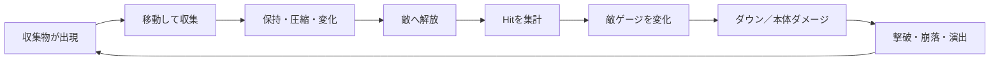
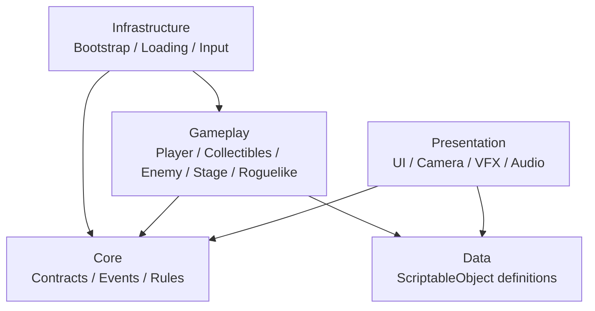

# CreatorKousien

[](https://unity.com/)
[](https://github.com/aptmara/CreatorKousien/actions/workflows/ci.yml)


大量のオブジェクトを集め、まとめて解放し、敵のゲージ・ダウン・ステージ変化へ連鎖させる見下ろし型3DアクションのUnityプロトタイプです。

このREADMEは、リポジトリの唯一の入口です。セットアップ、設計、フォルダ配置、UnityPackageの受け入れ、シーン、ゲーム仕様、開発運用、テスト、問題解決の各文書へ、すべてここから移動できます。

## Table of contents

- [プロジェクト概要](#プロジェクト概要)
- [現在の状態](#現在の状態)
- [Quick start](#quick-start)
- [ゲームのコアループ](#ゲームのコアループ)
- [アーキテクチャ概要](#アーキテクチャ概要)
- [リポジトリ構成](#リポジトリ構成)
- [UnityPackageを受け取ったら](#unitypackageを受け取ったら)
- [開発フロー](#開発フロー)
- [品質基準](#品質基準)
- [ドキュメント](#ドキュメント)
- [既知の問題](#既知の問題)
- [Contributing](#contributing)

## プロジェクト概要

| 項目 | 内容 |
| --- | --- |
| リポジトリ | `aptmara/CreatorKousien` |
| Unity | `6000.3.7f1` |
| Render Pipeline | Universal Render Pipeline |
| Input | Unity Input System |
| Product Name | `CreatorKousienURP` |
| 開発段階 | Prototype |
| 主要プラットフォーム | Windows Editorを基準に検証 |
| ライセンス | Private |

プロトタイプの核は「蓄積 × 解放」です。

1. フィールド上の収集物へ近づく。
2. 収集物をプレイヤー側へ取り込み、保持状態を変化させる。
3. まとまったPayloadを敵へ解放する。
4. 短時間の命中をまとめて評価する。
5. 敵のゲージ、ダウン、撃破、ステージ演出へ結果を伝播させる。
6. リザルトやローグライク強化を経て次のプレイへ進む。

詳細は[ゲームプレイ仕様](docs/GAMEPLAY.md)を参照してください。

## 現在の状態

### 実装・検証済みの基盤

- Boot、Loading、GameplayShellを使ったAdditive Scene構成
- Player、Collectibles、Enemies／Bosses、Stage、Roguelike、UI、Resultのコード・コンテンツ
- Build Settingsに登録された10シーン
- ScriptableObjectを利用したゲーム設定・ステージ・ウェーブ・アップグレードデータ
- UnityPackageを安全に隔離・検査・分類するAsset Intake
- GUIDと依存GUIDを維持するアセット移動処理
- EditMode／PlayModeテスト
- `.meta`漏れを検出するGitHub Actions

### 移行中の領域

- ゲーム固有コンテンツは`Assets/CreatorKousien`へ整理済みですが、コードは`Assets/Scripts`と`Assets/_Project`に分かれています。
- `Assets/Scripts`は既存のデフォルトアセンブリ、`Assets/_Project/Runtime`は`Game.Runtime` asmdefです。コンパイル境界が異なるため、一括移動は禁止です。
- 一部のLegacy／Developmentシーンには既存Missing Scriptがあります。詳細は[テストと品質保証](docs/TESTING.md)を参照してください。
- `DuplicateCandidates`と`_Recovery`は確認前に削除しない保留領域です。

## Quick start

### 必要なもの

- Unity Hub
- Unity Editor `6000.3.7f1`
- Git
- Git LFS
- Visual Studio、JetBrains Rider、またはVS Code系のC#開発環境

### Clone

```bash
git lfs install
git clone <repository-url>
cd CreatorKousien
git lfs pull
```

### Unityで開く

1. Unity Hubで`Add project from disk`を選ぶ。
2. このリポジトリのルートを指定する。
3. Unity `6000.3.7f1`で開く。
4. Package Managerの解決とスクリプトコンパイルが完了するまで待つ。
5. ConsoleのErrorが0件であることを確認する。
6. `Assets/CreatorKousien/Scenes/Application/Title.unity`を開く。
7. Playしてタイトルから開始する。

初回起動、IDE、MCP、よくある初期エラーは[セットアップガイド](docs/GETTING_STARTED.md)にまとめています。

## ゲームのコアループ



プレイヤーの判断は、単に全回収することではなく、保持量、解放タイミング、敵状態、バリア、アップグレード、ステージ状況の組み合わせから生まれることを目標にしています。

## アーキテクチャ概要



基本原則は以下です。

- ゲームルールからUI・VFXの具体実装を直接操作しない。
- 同期的な結果が必要な処理はinterfaceまたは明示的な呼び出しを使う。
- Eventは完了した事実の通知に使い、命令や戻り値を要求しない。
- ScriptableObjectへ実行中だけの状態を不用意に永続化しない。
- SceneやPrefabの内部階層ではなく、ルートコンポーネントと公開契約へ依存する。
- 大量オブジェクトを常時すべて物理演算せず、データ表現・表示上限・Poolを使い分ける。

レイヤー、依存方向、データ所有権、Event設計の詳細は[アーキテクチャ](docs/ARCHITECTURE.md)を参照してください。

## リポジトリ構成

```text
CreatorKousien/
├── Assets/
│   ├── CreatorKousien/
│   │   ├── Code/                 # プロジェクト専用Editor拡張とテスト
│   │   ├── Content/
│   │   │   ├── Features/         # Enemies, Player, Stageなど
│   │   │   ├── Presentation/     # UI, Audio, Camera, VFX
│   │   │   └── Shared/           # Fonts, PhysicsMaterialsなど
│   │   ├── Scenes/
│   │   │   ├── Application/
│   │   │   ├── Gameplay/
│   │   │   └── Development/
│   │   └── Settings/
│   ├── Scripts/                  # 既存の主要ゲームコード
│   ├── _Project/                 # Game.Runtime / Game.Tests asmdef領域
│   ├── Resources/                # Resources.Load対象だけ
│   ├── ThirdParty/               # 外部アセット
│   ├── AddressableAssetsData/
│   └── _Recovery/                # Unity復旧用・要確認
├── Packages/
├── ProjectSettings/
├── docs/
└── .github/
```

「どこへ何を置くか」は[プロジェクト構造](docs/PROJECT_STRUCTURE.md)と[アセット運用](docs/ASSET_WORKFLOW.md)で定義しています。

## UnityPackageを受け取ったら

アート素材の受け入れは、Unityの`Tools > CreatorKousien > Asset Intake`（`Ctrl/Cmd + Shift + I`）へ統一しています。

1. `.unitypackage`をウィンドウへドロップするか、`ファイルを選ぶ…`で指定する。
2. Import前の安全確認で、新規・導入済み・更新候補・危険な衝突を自動判定し、Script／DLLやScene混入を確認する。
3. 問題がなければ`Assets/_Incoming`へ隔離展開する。
4. パスとファイル種別から提案されたDomain、Entity、Category、配置先を確認する。
5. 信頼度が低い項目だけ絞り込み、個別編集または一括編集する。
6. 採用する項目を選び、`正式配置`を実行する。
7. GUIDと依存GUIDの検証結果を確認し、PrefabやModelのImport Settingsをレビューする。

Projectウィンドウ内の`.unitypackage`を開いた場合はAsset Intakeへ誘導されます。ExplorerなどからUnityへ直接Importした場合も、新規アート素材は`Assets/_Incoming/DirectImport`へ自動隔離され、既存ファイルの変更やScript／DLLは危険項目として画面に残ります。

同じGUID・Path・内容のAssetは導入済みとして自動スキップします。同じGUID・Pathで内容だけが異なる場合は更新候補となり、既存Assetを変更せず`Library/CreatorKousien/PackageComparisons`へPackage側の内容を書き出して比較できます。

通常敵は`Enemies/<EnemyName>`、ボスは`Bosses/<BossName>`、UIは画面単位、Stageは`StageNN`単位で分類します。画面の見方、自動判定ルール、例外時の復旧まで含む完全な手順は[アセット運用](docs/ASSET_WORKFLOW.md)を参照してください。

## 開発フロー

1. Issueで目的と完了条件を確定する。
2. `master`から短命ブランチを作る。
3. 変更対象に最も近いシーンまたはテストで実装する。
4. Console、シーン、EditMode、PlayModeを変更範囲に応じて検証する。
5. `.meta`とGit LFS対象を含めて差分を確認する。
6. PRテンプレートを埋め、レビュー可能な単位で提出する。

ブランチ、コミット、Scene所有権、Prefab契約、並列作業については[開発ガイド](docs/DEVELOPMENT.md)を参照してください。

## 品質基準

最低限、PR前に次を確認します。

- Unity ConsoleのコンパイルErrorが0件。
- 変更したScene／Prefabに新しいMissing ScriptやBroken Prefabがない。
- EditModeテストが成功する。
- ランタイムへ影響する場合はPlayModeテストが成功する。
- Build SettingsのScene順序とGUIDが意図せず変わっていない。
- 新規・移動アセットに対応する`.meta`が存在する。
- GUID重複がない。
- `Assets/_Incoming`や`IncomingPackages`をコミットしていない。
- 変更と無関係なScene保存・再シリアライズを含めていない。

テストの実行方法、シーン検査、基準値、既知のMissing Scriptは[テストと品質保証](docs/TESTING.md)を参照してください。

## ドキュメント

READMEからすべての正式文書へ直接移動できます。`docs`内に未リンクの正式文書を追加しないでください。

| 文書 | 読むタイミング | 内容 |
| --- | --- | --- |
| [Documentation index](docs/README.md) | 文書の全体像を確認するとき | 文書の責務、更新ルール、読み順 |
| [Getting started](docs/GETTING_STARTED.md) | 初回セットアップ時 | Unity、Git LFS、起動、IDE、MCP |
| [Architecture](docs/ARCHITECTURE.md) | システム境界を変更するとき | レイヤー、依存方向、イベント、データ、物量設計 |
| [Project structure](docs/PROJECT_STRUCTURE.md) | ファイルの置き場所を決めるとき | ルート構成、コード境界、Scene、Resources、ThirdParty |
| [Asset workflow](docs/ASSET_WORKFLOW.md) | デザイナー素材やUnityPackageを扱うとき | Intake、分類、命名、移動、検証 |
| [Scenes](docs/SCENES.md) | Sceneを追加・変更するとき | Build Settings、Additive構成、所有権、検証Scene |
| [Gameplay](docs/GAMEPLAY.md) | ゲームルールを実装・調整するとき | コアループ、収集、解放、敵、ナダレ、ローグライク |
| [Development](docs/DEVELOPMENT.md) | 日常開発・PR作成時 | Issue、Branch、Commit、並列作業、契約変更 |
| [Testing](docs/TESTING.md) | 実装完了・レビュー時 | Test Runner、Scene検査、meta、回帰基準 |
| [Troubleshooting](docs/TROUBLESHOOTING.md) | 起動・参照・Package問題が出たとき | Missing Script、GUID、Package、Scene、MCPの復旧 |

## 既知の問題

- `Application/Legacy/Select.unity`に既存Missing Scriptが3件あります。
- `Development/UI/Proto_G_UIDebug.unity`に既存Missing Scriptが2件あります。
- `_Recovery`内の2シーンに既存Missing Scriptが合計3件あります。
- コード配置は`Assets/Scripts`と`Assets/_Project`へ分かれており、asmdef再設計は未完了です。
- `Assets/CreatorKousien/Content/Presentation/UI/DuplicateCandidates`には削除判断前の重複候補があります。
- AddressablesのGroupには現在ランタイムアセット登録がなく、文字列ロードは一部`Resources.Load`を使用しています。

既知問題を「とりあえず削除」「Missing ScriptをRemove」で隠さず、参照元・GUID・利用Sceneを確認してください。復旧手順は[Troubleshooting](docs/TROUBLESHOOTING.md)にあります。

## Contributing

このリポジトリはIssue起点、短命ブランチ、Pull Requestレビューを前提とします。

- 1ブランチでは1つの目的だけを扱う。
- 共有Sceneの編集者を増やさない。
- 公開契約や保存形式を変更する場合は、実装前に影響を共有する。
- アセット移動はUnity Editorまたは検証付きツールを使う。
- ドキュメントを追加した場合はREADMEの一覧にも追加する。

詳細は[開発ガイド](docs/DEVELOPMENT.md)を参照してください。
