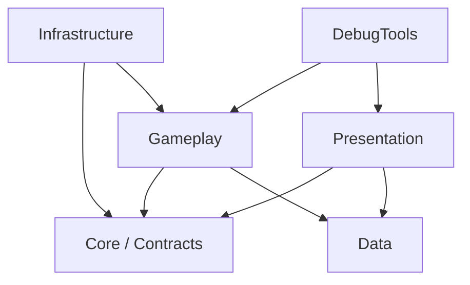
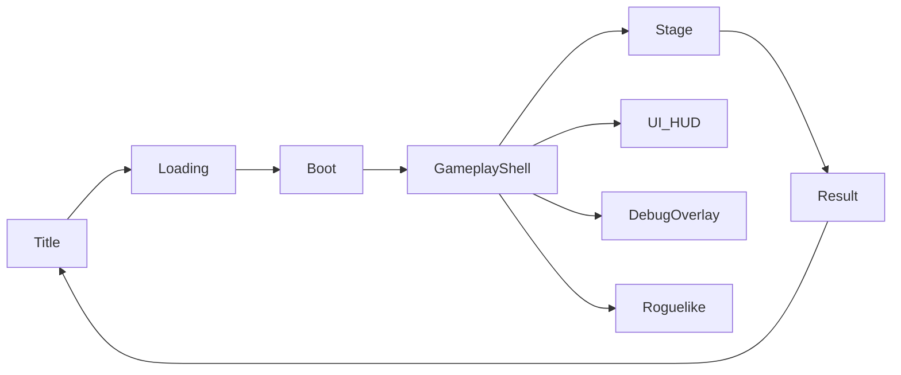

# Architecture

[← README](../README.md) | [Documentation index](README.md) | [Gameplay →](GAMEPLAY.md)

## 1. この文書の位置づけ

CreatorKousienの依存方向、システム境界、データ所有権、イベント、Scene接続、大量オブジェクトの扱いを定義します。

## 2. 現在のコード構成

現在の主なコード領域は次のとおりです。

| 領域 | 現在の場所 | 内容 |
| --- | --- | --- |
| Core | `Assets/Scripts/Core` | Contracts、Enemy、Management、Rule |
| Data | `Assets/Scripts/Data` | Collectibles、Field、Player、Systemの定義 |
| Gameplay | `Assets/Scripts/Gameplay` | Camera、Collectibles、Combo、Enemy、Player、Roguelike、Shop、Stage |
| Infrastructure | `Assets/Scripts/Infrastructure` | Bootstrap、Loading |
| Presentation | `Assets/Scripts/Presentation` | CameraFeedback、GameClear／GameOver、ScreenFeedback、UI、VFX |
| WaveSystem | `Assets/Scripts/WaveSystem` | Data、Runtime、Debug、Editor |
| Runtime asmdef | `Assets/_Project/Runtime` | Core contracts、Events、Roguelike runtime |
| Editor tooling | `Assets/CreatorKousien/Code/Editor` | Asset Organization tools |

`Assets/Scripts`の多くはデフォルトアセンブリ、`Assets/_Project/Runtime`は`Game.Runtime`です。この差は型の参照可能方向とMonoBehaviourのシリアライズに影響します。

## 3. Architecture principles

### 3.1 Component + Data Driven + Event Driven

- GameObject／MonoBehaviourはUnityとの接点とScene上の構成を担当する。
- 調整値や定義はScriptableObjectへ寄せる。
- システム間通知はEventを利用し、直接参照を増やさない。
- 同期的な戻り値が必要な処理はEventではなくinterfaceまたは明示的なメソッドを使う。

### 3.2 依存方向

禁止する依存の代表例:

- Gameplayが特定のUI GameObjectを検索・操作する。
- DataがPresentationを参照する。
- UIがEnemyやPlayerの内部状態を書き換える。
- StageがEnemy Prefabの内部子オブジェクト名に依存する。
- Event購読順を戻り値のように利用する。

### 3.3 データ所有権

状態を変更できる主体を1つにします。

| 状態 | Ownerの例 | 外部からの扱い |
| --- | --- | --- |
| Player progression | Player progression system | Command／公開API経由 |
| Collection state | Collection／buffer system | Snapshotを読む、要求を送る |
| Enemy HP／状態 | Enemy controller／runtime | Hit結果を渡す |
| Stage wave state | Wave runtime | Wave eventを購読する |
| UI表示状態 | Presenter／View | GameplayのSnapshot／Eventから更新 |
| Roguelike upgrades | Roguelike runtime state | 選択結果を適用する |

複数システムが同じScriptableObjectを直接書き換える構造は避けます。定義データと実行時状態を区別してください。

## 4. Event design

### 4.1 Eventを使う条件

Eventは「何かが完了した」という事実通知に向いています。

- Collection changed
- Payload released
- Enemy down started
- Enemy defeated
- Stage tilt started
- Run cleared

次はEventにしません。

- ダメージ計算結果を同期的に取得する処理
- 収集可能か問い合わせる処理
- データを返す必要がある検索
- 発行順によって正しさが変わる命令列

### 4.2 Event payload

- GameObjectやComponent参照を必要以上に含めない。
- ID、値、位置、読み取り専用Snapshotを優先する。
- Event名は完了した事実として読める名前にする。
- UI用の整形文字列ではなく、意味のある値を渡す。
- 破棄されたUnity Objectを購読者が保持し続けないようにする。

## 5. ScriptableObject design

ScriptableObjectは調整可能な定義に使います。

- Enemy definition
- Player／collectible definition
- Stage／wave data
- Sound data
- Roguelike upgrade／pool data
- Cinematic settings

原則:

1. Asset上の定義値とランタイム状態を分ける。
2. 一意IDを使う場合は重複を検証する。
3. Scene再生後にAssetへ値が残らない設計にする。
4. Assetのリネーム・移動はGUIDを保持して行う。
5. 未設定参照を許可するか、必須として検証するかを型ごとに決める。

## 6. Scene composition

Application SceneとAdditive Gameplay Sceneを組み合わせます。

- Boot／LoadingはサービスとScene遷移を準備する。
- GameplayShellはGameplay Sceneの接続点になる。
- Stage、UI、Debugは責務を分離する。
- Development Sceneは単体検証に使い、本番Sceneの代替にしない。

詳細は[Scenes](SCENES.md)を参照してください。

## 7. 大量オブジェクト設計

本プロトタイプでは物量がゲームフィールと性能の両方へ直結します。

| 状態 | 推奨表現 | 理由 |
| --- | --- | --- |
| Field上 | 必要なCollider／Rigidbodyを持つPrefab | 収集可能な世界を見せる |
| 収集中 | データ＋表示上限付きVisual | 全数を常時物理追従させない |
| 解放中 | PoolされたProjectile／Rigidbody | 一時的な物理演出に限定する |
| Hit処理 | 短時間のBatch | 大量ヒットを毎回重い処理へ流さない |
| 雪崩／崩落 | 制御されたFlow＋必要部分だけ物理 | 再現性と調整性を保つ |

表示数と論理Payload数を同一にする必要はありません。視覚上の密度を保ちながら、Pool、Batch、更新頻度制御を使います。

## 8. Prefab contract

共有Prefabはルートコンポーネントを契約とします。

- 外部は内部子階層を直接検索しない。
- CameraをPlayerやStage Prefabへ内包しない。
- EnemyはPlayerを`Find`で探さず、Contextまたは登録処理で受け取る。
- Collectibleは可能な場合Poolへ戻し、大量生成・破棄を繰り返さない。
- 必須Inspector参照を変更した場合は利用Sceneを検証する。
- Prefab Variantを使う場合、Base Prefabの変更影響を確認する。

## 9. asmdef strategy

### 現在の構成

- `Game.Runtime`はUnity TextMeshPro、Addressables、ResourceManagerを参照します。
- `Game.Tests`はRuntimeテスト領域です。
- Asset OrganizationはEditor専用asmdefとEditModeテストasmdefへ分離されています。
- `Assets/Scripts`の大部分はまだデフォルトアセンブリです。

### 将来の分割方針

将来的にCore、Data、Gameplay、Presentation、Infrastructureをasmdef分割する場合は、別作業として次を満たしてから実施します。

1. 現在の型参照グラフを取得する。
2. Scene／Prefabに保存されたMonoScript GUIDを維持する。
3. EditorコードとRuntimeコードを分離する。
4. 循環参照を解消する。
5. 1 asmdefずつ移行し、毎回コンパイルとScene検査を行う。

フォルダ整理とasmdef導入を同時に大規模実行しないでください。

## 10. 拡張時の設計方針

次の構造を追加・拡張するときは、既存の同等機能を確認してから設計します。

- Payload／PayloadBatchを中心とした収集状態の軽量表現
- HitBatchAccumulatorによる短時間命中の集約
- Enemy gauge／barrier／downをFacadeの背後へ閉じる構成
- StageDefinitionによるStage差し替え
- FeedbackProfileによるCamera／VFX／Audioのデータ駆動
- Object PoolとMetrics Overlay

新規実装時は既存コードを調査し、同等機能を重複追加しないでください。

## 11. Architecture change checklist

- [ ] 変更するOwnerと公開契約を特定した
- [ ] 依存方向が逆転しない
- [ ] 保存形式・ScriptableObject形式への影響を確認した
- [ ] Scene／PrefabのMonoBehaviour参照への影響を確認した
- [ ] Eventと同期APIの使い分けが明確
- [ ] asmdef参照に循環がない
- [ ] 大量生成・毎フレーム処理の上限を確認した
- [ ] 変更に対応するテストまたは検証Sceneを用意した
