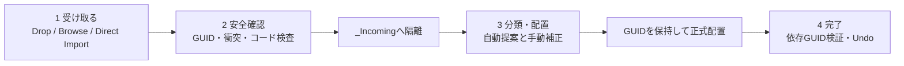

# Asset Intake workflow

[← README](../README.md) | [Project structure](PROJECT_STRUCTURE.md) | [Troubleshooting →](TROUBLESHOOTING.md)

## 1. 入口

デザイナーから受け取った`.unitypackage`と素材は、Unityの次の画面から受け入れます。

```text
Tools > CreatorKousien > Asset Intake
ショートカット: Ctrl/Cmd + Shift + I
```

この画面だけで、受け取り、安全確認、自動分類、正式配置、直前の配置取り消しまで完結します。通常の作業ではExplorerで`Assets`へコピーしたり、Projectウィンドウで手動移動したりする必要はありません。



## 2. 最短手順

### デザイナー

1. `Tools > CreatorKousien > Asset Intake`を開く。
2. `.unitypackage`を大きなドロップ領域へ置く。
3. `安全確認を開始`を押す。
4. 赤いErrorがなければ`安全な一時領域へ展開`を押す。
5. `要確認のみ`をONにし、黄色または赤色の行だけ確認する。
6. 分類が違う行はDomain、Entity、Categoryを変更する。
7. 不要な素材は左端のチェックを外す。
8. 画面下の`正式配置`を押す。
9. 対象PrefabまたはModelを開き、見た目とImport Settingsを確認する。

迷った場合は、勝手に`Shared`へまとめず、行のチェックを外して担当者へ確認してください。チェックを外した素材は`_Incoming`に残るため、後から再開できます。

### 開発者

デザイナー手順に加えて、次を確認します。

- Script、asmdef、DLL、Android pluginが検出されていないこと。
- 導入済み、更新候補、危険なGUID／Path衝突の判定が意図どおりであること。
- Entityが通常敵、ボス、Stage、UI画面の境界と一致すること。
- 正式配置後のGUID・依存GUID検証が成功していること。
- PrefabにMissing Script／Broken Prefabがないこと。
- `_Incoming`を本番SceneやPrefabから参照していないこと。

## 3. 4ステップ画面

### 3.1 受け取る

`.unitypackage`は次のいずれかで指定できます。

- 画面中央へドラッグ＆ドロップする。
- `ファイルを選ぶ…`から選ぶ。
- Projectウィンドウ内に置かれた`.unitypackage`を開く。

Projectウィンドウ内のPackageは、Unity標準ImportではなくAsset Intakeで開きます。指定した時点ではPackageを展開せず、プロジェクトのファイルも変更しません。

`Explorerなどから直接ImportしたUnityPackageを自動検知する`は通常ONのまま使用します。この設定はUnity Editor単位で保存されます。

### 3.2 安全確認

Packageのgzip／tarを読み、Import前に次を検査します。

| 検査 | Errorになる条件 | 目的 |
| --- | --- | --- |
| Path | `Assets/`外、絶対Path、`..`を含む | 意図しない場所への展開を防ぐ |
| asset/meta | assetまたはmetaの片方がない | GUID欠落を防ぐ |
| Package内重複 | 同じPathまたはGUIDが複数ある | 上書きと参照混線を防ぐ |
| 既存GUID | 同じGUIDの既存Pathとasset/metaハッシュを比較 | 再導入、更新、衝突を区別する |
| 既存Path | 同じPathに別GUIDが使われている | 既存参照の置換を防ぐ |
| 展開先衝突 | `_Incoming`の同じPathにAssetがある | 前回受け入れとの上書きを防ぐ |
| 実行コード | Script、asmdef、DLL、pluginを含む | コンパイル・ビルド構成の無断変更を防ぐ |
| Scene | `.unity`を含む | Scene全体の混入を明示する |

次の拡張子はアート素材として自動受け入れません。

```text
.cs .asmdef .asmref .rsp .dll .aar .jar
```

Errorが1件でもある場合、隔離展開ボタンは無効になります。該当ファイルだけPackageから除くか、コード導入として別途レビューしてください。

画面上部の件数は次の4状態で表示します。

| 状態 | 条件 | 動作 |
| --- | --- | --- |
| 新規 | GUIDとPathが未使用 | `_Incoming`へ展開して自動分類する |
| 導入済み | 同一GUID・同一Pathでasset/metaのSHA-256も同じ | 自動スキップする |
| 更新候補 | 同一GUID・同一Pathだがassetまたはmetaの内容が異なる | 既存Assetを維持し、比較用出力を案内する |
| 停止 | 同一GUIDが別Path、同一Pathが別GUID、コード／Plugin、壊れたPackage | 展開を停止して修正方法を表示する |

更新候補の`比較用に書き出す`を押すと、Package側のassetとmetaだけを次へ出力します。

```text
Library/CreatorKousien/PackageComparisons/<PackageName>_<日時>/Assets/...
```

この場所はUnityのAsset Database外なので、既存GUIDや既存Assetには影響しません。内容を比較して更新が必要だと判断した場合も、この画面から既存Assetを自動上書きすることはありません。

### 3.3 分類・配置

安全確認後、Package内の「新規」だけが次の場所へ隔離展開されます。導入済み、更新候補、停止対象は展開されません。

```text
Assets/_Incoming/Packages/<PackageName>_<日時>/...
```

各行には次の情報が表示されます。

| 表示 | 意味 |
| --- | --- |
| チェック | 今回正式配置するか |
| ファイル名・元Path | Package内の由来 |
| 判定理由 | Enemy、Boss、UI、拡張子など、分類に使った根拠 |
| 信頼度 | 自動採用してよい確度 |
| Domain | 機能または表現上の所有者 |
| Entity | Enemy名、Boss名、Stage番号、UI画面など |
| Category | Prefabs、Models、Materials、Texturesなど |
| 配置先 | 実行前に確定した最終Path |

信頼度の扱い:

| 信頼度 | 初期選択 | 操作 |
| --- | --- | --- |
| 高 | ON | 配置先を目視確認する |
| 中 | ON | EntityとCategoryを確認する |
| 低 | OFF | Domain／Entityを人が決めてからONにする |

`Scenes`と`Other`も確認対象となり、推奨選択には入りません。検索欄は元Path、配置先、Domain、Entity、Categoryを対象に絞り込みます。`要確認のみ`を使うと、判断が必要な行だけを確認できます。

複数行を同じEnemyやUI画面へまとめる場合は、対象行をチェックして`選択中のAssetを一括変更`を使います。一括変更後も各行の配置先が即時更新されます。

同じ配置先が複数行に割り当てられた場合や、配置先に既存Assetがある場合、正式配置ボタンは無効になります。ファイル名、Entity、Categoryのいずれかを直してください。

### 3.4 完了

正式配置では`AssetDatabase.MoveAsset`を使い、`.meta`を伴って移動します。移動前後で次を照合します。

- Asset自身のGUID
- Assetが参照する依存GUIDの集合
- 配置先の衝突

検証に失敗した場合、完了済みの移動を逆順に戻します。成功後は`直前の配置を取り消す`で、そのウィンドウから実施した直近1回の配置を戻せます。Undo前に配置先のGUIDが変わった、元Pathが埋まったなど、安全に戻せない状態ではUndoを無効化します。

## 4. 自動分類ルール

分類は元Path全体と拡張子を使用します。フォルダ名だけでなく、ファイル名に含まれる`Boss`、`Enemy`、`HUD`、`Stage02`なども根拠になります。

### 4.1 Domain

| 優先される語・形式 | Domain | Entityの決め方 | 配置Root |
| --- | --- | --- | --- |
| `Boss`, `Bosses`, `JackFlower` | Bosses | Bossフォルダ直下の名前 | `Content/Features/Enemies/Bosses/<Name>` |
| `Enemy`, `Enemies`, `Monster`, `Zombie`, `Ghost`, `Bat` | Enemies | Enemyフォルダ直下またはファイル名 | `Content/Features/Enemies/<Name>` |
| `Player`, `Attachment`, `Hand`, `Arm` | Player | AttachmentまたはShared | `Content/Features/Player/<Entity>` |
| `Collectible`, `Candy`, `Crystal`, `DropItem` | Collectibles | 種別名 | `Content/Features/Collectibles/<Name>` |
| `Stage`, `Field`, `Terrain`, `StageNN` | Stage | `StageNN`、不明ならShared | `Content/Features/Stage/<Entity>` |
| `Roguelike`, `Upgrade`, `Reroll` | Roguelike | Shared | `Content/Features/Roguelike` |
| `Shop`, `Clerk` | Shop | Shared | `Content/Features/Shop` |
| `UI`, `HUD`, `Title`, `Loading`, `Result` | UI | Title／Loading／HUD／Result等 | `Content/Presentation/UI/<Screen>` |
| 音声拡張子、`Audio`, `BGM`, `SE` | Audio | Shared | `Content/Presentation/Audio` |
| `Camera`, `Cinemachine` | Camera | Shared | `Content/Presentation/Camera` |
| `VFX`, `Effect`, `Particle`, `Smoke`, `Glow` | VFX | Shared | `Content/Presentation/SharedVFX` |
| `Debug`, `Prototype`, `Playtest` | Development | Shared | `Content/Development` |
| `ThirdParty`, `License`, `ReleaseNotes` | ThirdParty | Vendor／Package名 | `Assets/ThirdParty/<Name>` |
| 根拠なし | Shared | Shared | `Content/Shared` |

Boss判定はEnemy判定より優先します。Enemy固有のVFXはEnemy Domainを維持し、Categoryを`VFX/Textures`などにするため、共有VFXへ誤って分離しません。

### 4.2 Category

| Asset種別 | Category |
| --- | --- |
| Prefab | `Prefabs` |
| FBX／OBJ／Blend | `Models` |
| Material／Physics Material | `Materials` |
| PNG／PSD／TGA／JPG等 | `Textures` |
| AnimationClip／Animator Controller／Avatar | `Animations` |
| WAV／MP3／OGG／AIFF | `Audio` |
| Shader／Shader Graph／HLSL | `Shaders` |
| ScriptableObject等の`.asset` | `Data` |
| Scene | `Scenes`。自動選択しない |
| 判定外 | `Other`。自動選択しない |

EnemyなどのPath内にVFX／Effectがある場合は、Prefab、Material、Textureを`VFX/Prefabs`、`VFX/Materials`、`VFX/Textures`へ分けます。

## 5. UnityPackageを直接Importした場合

Explorerから`.unitypackage`を開くなど、Unity標準のImport Package画面を経由した操作も監視します。

1. Import開始時に`Assets`配下のPath、GUID、ファイル状態をSnapshotする。
2. Import完了後にSnapshotとの差分を取る。
3. 新規に追加されたアートAssetを、元の相対Pathを保ったまま次へ移す。

```text
Assets/_Incoming/DirectImport/<PackageName>_<日時>/...
```

4. Asset Intakeを自動で開き、通常と同じ自動分類・正式配置へ進む。

直接Importでは、Unity標準APIの都合で既存ファイルへの書き込みをImport前に止められません。そのため次は自動移動・自動復元を行わず、赤い危険項目として表示します。

- 既存Assetまたは`.meta`が変更された。
- Script、asmdef、DLL、AAR、JARが追加された。
- GUIDを取得できないAssetがある。
- 自動隔離中の移動または検証に失敗した。

危険項目がある場合は、内容を確認したチェックをONにするまで正式配置できません。既存ファイルが変更された場合は、Git diffで対象を確認し、意図した変更でなければGitの履歴から対象ファイルだけを復元します。復元対象が分からない状態で`.meta`を削除しないでください。

## 6. 正式配置先の考え方

同じキャラクターを構成するModel、Material、Texture、Animation、PrefabはEntity単位で近接させます。

```text
Assets/CreatorKousien/Content/Features/Enemies/Bat/
├── Models/
├── Materials/
├── Textures/
├── Animations/
├── Prefabs/
└── VFX/
    ├── Prefabs/
    ├── Materials/
    └── Textures/
```

次のような分類を避けます。

- 全EnemyのTextureを巨大な共通`Textures`へ集める。
- 通常敵とBossを同じEntityに入れる。
- HUD、Title、Resultの素材を`UI/Shared`へまとめる。
- 特定Stage専用素材を`Stage/Shared`へ置く。
- 出所やライセンスを失ったままThirdParty素材をゲーム固有フォルダへ移す。

複数Entityで本当に共有する素材だけをSharedへ置きます。「分類が分からない」はSharedの根拠ではありません。

## 7. 隔離後のレビュー

### Model／Animation

- Scale Factor、単位、軸が既存モデルと一致する。
- RigがNone／Generic／Humanoidの用途と一致する。
- Animation範囲、Loop、Root Motionが意図どおりである。
- Read/Write、Mesh Compressionを必要以上に有効化していない。
- Model内Materialの抽出で重複を増やしていない。

### Texture／Sprite

- Texture Type、sRGB、Alpha設定が用途と一致する。
- Normal MapをDefaultとして扱っていない。
- Max Size、Compression、Platform Overrideが過大でない。
- UI SpriteのPixels Per Unit、Mesh Typeが周辺素材と一致する。

### Material／Shader／VFX

- URPで表示できるShaderを使用する。
- Built-in／HDRP専用Shaderや不足Packageへ依存していない。
- TextureやSubEmitterが欠落GUIDを参照していない。
- Camera、Light、VolumeをPrefabへ不用意に含めていない。

### Prefab

- Missing ScriptとBroken Prefabが0件である。
- Package外のScene Objectを参照していない。
- Root Transform、Scale、Layer、Tagが適切である。
- Animator、Avatar、Material、VFXの参照が正式Pathを向いている。

### Audio

- Load Type、Compression、Qualityが用途と一致する。
- 長尺BGMをDecompress On Loadにしていない。
- Loop素材の継ぎ目を確認した。
- Mono化が許容されるSEだけForce To Monoを使う。

### License

- 商用利用、改変、再配布、クレジット条件を確認する。
- License、Readme、Release Notesは`ThirdParty/<Vendor>`に残す。
- 出所不明の素材を正式配置しない。

## 8. 中断・再開・復旧

### 分類を後で続ける

`_Incoming`内で対象Assetを選択し、次を実行します。

```text
Tools > CreatorKousien > Promote Selected Incoming Assets
```

選択Assetが同じ分類画面に読み込まれます。

### 正式配置を間違えた

完了画面の`直前の配置を取り消す`を使います。Unity再起動後も直近の受領情報はSession内に保持されますが、他の移動でSourceまたはDestinationが変わった場合は安全のため実行できません。

### Packageの安全確認で止まった

- Path／GUID衝突: Package作成者に修正版を依頼する。
- Script／DLL: アート素材PackageとコードPackageを分離する。
- asset/meta不足: Unity側でPackageを書き出し直す。
- 展開先衝突: 以前の`_Incoming`を確認し、作業を完了または破棄してから再実行する。

### 直接Importで既存Assetが変更された

1. Asset Intakeの赤い一覧からPathを控える。
2. `git diff -- <path>`で内容と`.meta`を確認する。
3. 変更を採用するか、対象ファイルだけ復元するか決める。
4. Console ErrorとPrefab／Scene参照を確認する。
5. 危険項目の確認チェックをONにして、隔離済みの新規Assetだけ分類する。

## 9. 完了条件

- [ ] 安全確認のErrorが0件
- [ ] 低信頼、Scenes、Otherを人が確認した
- [ ] 通常敵とBossが別Entityになっている
- [ ] Stage専用素材とUI画面素材が適切なEntityになっている
- [ ] 不要Assetのチェックを外した
- [ ] 配置先衝突が0件
- [ ] GUIDと依存GUIDの検証が成功した
- [ ] PrefabのMissing Script／Broken Prefabが0件
- [ ] Model、Texture、AudioのImport Settingsを確認した
- [ ] Licenseを確認した
- [ ] 正式なScene／Prefabが`_Incoming`を参照していない
- [ ] Unity ConsoleのErrorが0件
- [ ] `.meta`漏れとGUID重複がない

## 10. Gitで扱う範囲

| 領域 | Git | 用途 |
| --- | --- | --- |
| `IncomingPackages/` | Ignore | 受領したPackage原本 |
| `Assets/_Incoming/` | Ignore | 検査・分類中の一時Asset |
| `Assets/CreatorKousien/Content/` | Track | 採用したゲーム固有Asset |
| `Assets/ThirdParty/` | Track | 採用した外部AssetとLicense |

コミット前に`IncomingPackages`と`Assets/_Incoming`が差分へ入っていないことを確認してください。
