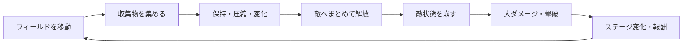
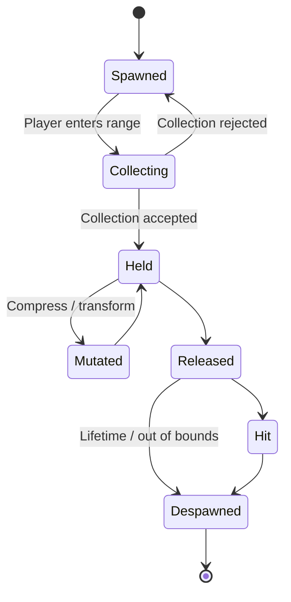
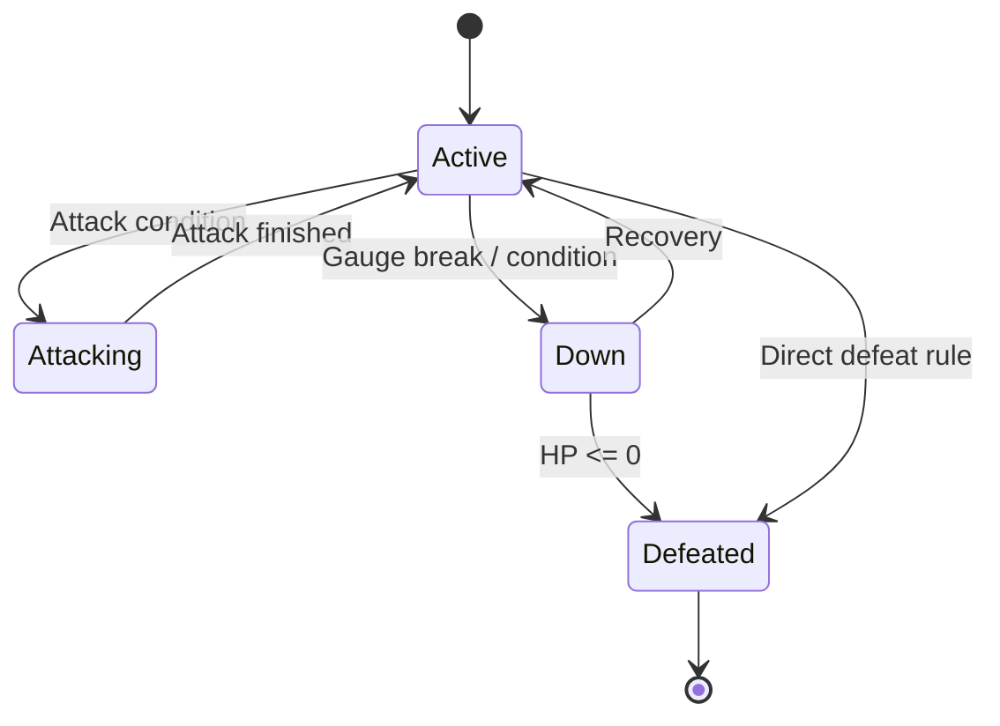
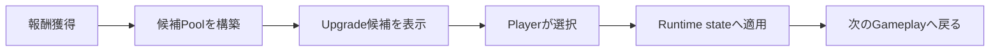

# Gameplay

[← README](../README.md) | [Architecture](ARCHITECTURE.md) | [Scenes](SCENES.md)

## 1. ゲームの核

CreatorKousienのコア体験は「蓄積 × 解放」です。



プレイヤーが感じるべき差は次の3段階です。

1. 少量を拾ったときより、大量に集めたときの見た目と期待が大きい。
2. 少量ずつ当てるより、狙ったタイミングでまとめて解放した結果が大きい。
3. 敵撃破が単体の終了ではなく、次の敵・Stage・Roguelike選択へ連鎖する。

## 2. Gameplay state

| 状態 | プレイヤーの目的 | 主なシステム |
| --- | --- | --- |
| Entry | Runを開始する | Title、Loading、Boot |
| Explore／Collect | 移動し収集物を確保する | Player Move、Collectibles、Stage |
| Prepare | 保持量と対象を判断する | Collection state、Combo、Enemy state |
| Release／Attack | 収集物を敵へ当てる | Release、Collision、Enemy damage |
| Enemy reaction | ダウン・撃破条件を作る | Enemy、Boss、VFX、UI |
| Reward／Upgrade | 次の選択を行う | Roguelike、Shop、Money |
| Result | Runを終了・再開する | Result、GameClear、GameOver |

## 3. Player

### 3.1 移動

- 見下ろし視点で入力方向と移動方向が直感的に一致すること。
- 加速、減速、旋回は収集の狙いやすさを損なわないこと。
- 大量保持による速度影響を入れる場合、数値だけでなく見た目とUIでも伝えること。
- Camera基準入力を使う場合、Camera回転時にも入力方向が破綻しないこと。
- Gameplay開始時、Input ActionのEnable／Disable状態を明示的に管理すること。

### 3.2 収集範囲

- Colliderまたは明示的な検索範囲でCollectible候補を得る。
- 同じCollectibleを1回の収集処理で重複登録しない。
- 収集可能条件と見た目の吸い込み演出を分ける。
- 収集失敗時にField Assetを消さない。
- Debug Sceneでは収集範囲をGizmoまたはOverlayで確認できるようにする。

### 3.3 Player progression

Player Data、Level Table、Roguelike Upgradeが同じ能力値を変更する場合、最終値の計算順を一箇所へ集約します。

例:

```text
FinalValue = BaseValue
           × PermanentProgression
           × RunUpgradeMultiplier
           + TemporaryModifier
```

加算・乗算順序を各MonoBehaviourへ分散させないでください。

## 4. Collectibles

### 4.1 Lifecycle



### 4.2 DefinitionとRuntime

Collectibleの定義と実行時状態を分けます。

| 種類 | 例 | 扱い |
| --- | --- | --- |
| Definition | Power、Weight、Prefab、Category | ScriptableObjectで共有 |
| Runtime | 現在位置、収集済み、圧縮状態 | Scene／Runtime instance |
| Snapshot | UI表示用の個数やカテゴリ | 読み取り専用 |

### 4.3 圧縮・変化

圧縮や形状変化は見た目だけでなく、次のいずれかへ接続します。

- 保持コスト減少
- Gauge damage増加
- Body damage増加
- Barrier突破
- Combo／Hit数の変化
- 移動速度とのTrade-off

変化条件はInspectorまたはDataで調整可能にし、コード内のMagic Numberへ埋め込みません。

## 5. Release and hit

### 5.1 Release

- 入力、解放量、方向、対象、見た目生成を分離する。
- 実Payload数と表示Projectile数を同一にする必要はない。
- 大量解放時も表示上限を持つ。
- Spawn／Despawnを繰り返すものはPoolを検討する。
- 解放後にCollection stateとUI表示が一致すること。

### 5.2 Hit aggregation

短時間に大量のCollider callbackが発生するため、敵への評価をBatch化します。

Batchで保持する候補:

- Hit count
- Total gauge damage
- Total body damage
- Total weight
- Element／Category内訳
- First／last hit time
- Source player／release ID

同じProjectileによる多重Hitを許可するかは、Projectileごとに明示します。

## 6. Enemies

### 6.1 分類

- 通常敵: `Features/Enemies/<EnemyName>`
- ボス: `Features/Enemies/Bosses/<BossName>`
- Spawn設定: `Features/Enemies/Spawner`
- 共有Status／VFX: `Features/Enemies/VFX`

### 6.2 State

一般的な敵状態は次のように整理します。実装する敵がすべて同じStateを持つ必要はありませんが、状態遷移を暗黙のbool組み合わせへしないようにします。



### 6.3 Gauge

Gaugeを使う敵では、次をUIから読めるようにします。

- 現在値と最大値
- 時間で増加／減少する方向
- 攻撃発動位置
- ダウン条件
- ダメージ無効区間
- 現在のBarrier状態

Gauge計算はEnemy Ownerへ集約し、UIが値を補正しません。

### 6.4 Barrier

Barrier候補:

- Gauge範囲による無効
- 属性による軽減
- Hit数閾値
- Weight閾値
- ダウン時だけ本体ダメージ有効

Barrierが機能しているとき、プレイヤーが「バグで効いていない」と感じないよう、色、Icon、SE、Hit feedbackで理由を示します。

### 6.5 Boss

Bossは通常敵の数値拡大だけにせず、Stageまたは時間のRuleと接続します。

- Phase変化
- Fieldへの攻撃
- Spawn pattern変化
- 特定Collectible／Payload要求
- 時間制限
- Camera／Cinematic

Boss固有実装を共通Enemyクラスへ増やし続けず、Boss Dataまたは固有Componentへ閉じます。

## 7. Stage and wave

### 7.1 Stage ownership

Stageは次を構成します。

- Field bounds
- Player spawn
- Collectible spawn zones
- Enemy slots／spawner
- Wave data
- Out-of-bounds処理
- Stage gimmick
- Clear／failure条件への通知

### 7.2 Wave

Wave DataとRuntimeを分けます。

- Data: 出現対象、タイミング、順序、条件
- Runtime: 現在Wave、経過時間、生存敵、完了状態
- Debug: 任意Wave開始、進行表示、強制完了
- Editor: Data作成・検証

Wave Dataを変更したら`WavePlaytestBoot`で検証します。

### 7.3 崩落・雪崩

敵撃破やStageイベントを次の結果へ連鎖させます。

1. 発動条件を確定する。
2. Stage方向・対象範囲を決める。
3. Camera／VFX／Audioへ開始Eventを通知する。
4. Field Objectの移動または演出Flowを開始する。
5. 巻き添えHitがある場合は通常Hitと区別する。
6. 終了後にStage状態を復帰する。

完全物理へ依存すると再現性が下がるため、ゲームルール上の結果と見た目の物理演出を分けます。

## 8. Combo

Comboは短時間の連続行動を可視化し、解放結果の気持ちよさを増幅します。

- ComboのOwnerを1つにする。
- 時間窓、加算条件、Reset条件をData化する。
- UIはOwnerのSnapshotを表示する。
- Pause、Scene transition、ResultでResetする。
- 1回のBatchを1 Comboとして数えるか、内部Hit数を数えるかを明示する。

## 9. Roguelike and shop

### 9.1 Upgrade flow



- Upgrade definitionとRuntime適用状態を分ける。
- 同一Upgradeの重複可否と上限をDataで明示する。
- Reroll cost、Shop cost、Money変化は1つのOwner経由で行う。
- UI ButtonからPlayer Componentを直接変更しない。
- Run終了時にRuntime stateをResetする。

### 9.2 Upgrade category

現在のUpgrade群には、Move Speed、Hand Size、Drop、Damage、Spawn、Money、Reroll、Shop、Boss／Normal Enemy Damage、Barrierなどの候補があります。

新規Upgradeでは次を定義します。

- ID
- Display name／description
- Category
- Icon
- Base value／stack rule
- Max stack
- 対象能力
- 適用と解除方法
- Save対象かRun限定か

## 10. UI and feedback

UIは次を伝える責務があります。

- Player HP／状態
- 保持数／容量
- Enemy gauge／down／barrier
- Combo
- Money／Upgrade
- Clear／failure
- Loading／transition

Feedback原則:

- 数値変化、色、Animation、SE、Cameraを同じEventへ重ねすぎない。
- 大量Hit時は1HitごとにVFXを無制限生成しない。
- HitStopやTime Scale変更のOwnerを明確にする。
- UI更新を毎フレームの文字列生成にしない。
- GameClear／GameOver中の入力とScene遷移を二重実行させない。

## 11. Clear and failure

Clear／failure条件はStageやUIへ分散させず、進行管理へ集約します。

候補条件:

- 指定Enemy／Boss撃破
- Wave完了
- Player HP 0
- 制限時間終了
- Stage固有Objectの落下／破壊

結果遷移では次を一度だけ実行します。

1. Gameplay入力停止
2. Spawn／Wave停止
3. Cinematic開始
4. Run result確定
5. Result Scene load
6. 前Scene unload

## 12. Performance budgets

プロトタイプの初期観測目安です。実機計測で更新します。

| 対象 | 初期目安 | 超えた場合の検討 |
| --- | ---: | --- |
| Field Collectibles | 100〜300 | 遠距離更新停止、Collider整理 |
| 論理的な保持数 | 最大300 | 配列再確保、Snapshot頻度を確認 |
| 保持Visual | 最大50程度 | Cluster表示 |
| 同時Projectile | 50〜100 | 代表Projectile、Pool |
| Hit aggregation | 0.2〜0.5秒 | Event／Collider処理回数を削減 |
| UI更新 | 値変化時 | 毎フレーム文字列生成を避ける |
| VFX | Eventごとに上限 | Batch演出へまとめる |

## 13. Gameplay acceptance checklist

- [ ] 初見で収集対象が分かる
- [ ] 収集したことが見た目と音で分かる
- [ ] 保持量が読み取れる
- [ ] 解放方向と対象が予測できる
- [ ] 少量と大量解放の結果差がある
- [ ] Enemyへの有効／無効Hitの理由が分かる
- [ ] Down／Defeat状態が明確
- [ ] Stageイベントが次の行動へ影響する
- [ ] Upgrade適用前後の差を確認できる
- [ ] 1プレイがTitleからResultまで閉じる
- [ ] 大量オブジェクト時にも操作可能なFrame Rateを維持する
