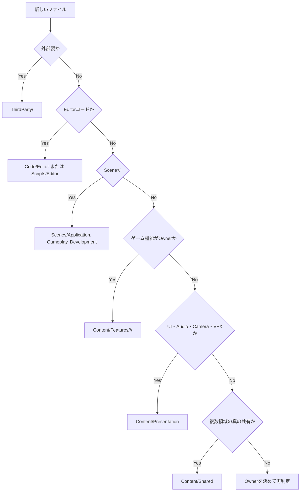

# Project structure

[← README](../README.md) | [Documentation index](README.md) | [Asset workflow →](ASSET_WORKFLOW.md)

## 1. 配置の基本方針

配置先は「誰が作ったか」ではなく「プロジェクト内で何の責務を持つか」で決めます。

- ゲーム固有コンテンツ: `Assets/CreatorKousien`
- 既存ゲームコード: `Assets/Scripts`
- asmdef分離済みRuntime／Tests: `Assets/_Project`
- 実行時文字列ロード対象: `Assets/Resources`
- 外部製アセット: `Assets/ThirdParty`
- Unity／Package固有領域: 専用ルートを維持
- 一時受け入れ: `Assets/_Incoming`。Git管理しない

## 2. リポジトリルート

| パス | 役割 | 編集時の注意 |
| --- | --- | --- |
| `Assets/` | Unity Asset Databaseの管理対象 | `.meta`を必ず維持する |
| `Packages/` | Unity Package依存 | バージョン・lock差分を確認する |
| `ProjectSettings/` | Project全体設定 | SceneやPackage変更と無関係な差分を混ぜない |
| `docs/` | 正式な開発文書 | すべてREADMEからリンクする |
| `.github/` | CI、Issue、PR運用 | Workflowの権限とShell差を確認する |
| `IncomingPackages/` | UnityPackageのローカル受け取り | `.gitignore`対象 |

## 3. `Assets/CreatorKousien`

```text
Assets/CreatorKousien/
├── Code/
│   ├── Editor/
│   │   └── AssetOrganization/
│   └── Tests/
│       └── EditMode/
├── Content/
│   ├── Development/
│   ├── Features/
│   ├── Presentation/
│   └── Shared/
├── Scenes/
│   ├── Application/
│   ├── Gameplay/
│   └── Development/
└── Settings/
```

### 3.1 `Code`

新しいプロジェクト専用Editorツールと、そのテストを置きます。

- RuntimeコードをEditor asmdef配下へ置かない。
- Editor APIを利用するコードはEditor専用asmdefにする。
- テストは対象asmdefを参照する独立asmdefへ置く。
- 既存`Assets/Scripts`のコードを、整理だけを目的にここへ移さない。

### 3.2 `Content/Features`

ゲームプレイ機能に所有されるアセットです。

```text
Features/
├── Collectibles/
├── Enemies/
│   ├── Bosses/
│   ├── Spawner/
│   └── VFX/
├── Player/
├── Roguelike/
├── Shop/
└── Stage/
    ├── Shared/
    └── Stage01/
```

機能配下は必要に応じてエンティティ、その下をアセット種類で分けます。

```text
Features/Enemies/<EnemyName>/
├── Data/
├── Prefabs/
├── Models/
├── Materials/
├── Textures/
├── Animations/
└── VFX/
```

分類ルール:

- 複数機能で本当に共有するものだけ`Shared`へ置く。
- 1つの敵だけで使うMaterialを`Enemies/Materials`へまとめず、敵固有フォルダへ置く。
- Boss固有素材は`Enemies/Bosses/<BossName>`へ置く。
- Spawn制御用Dataは`Enemies/Spawner`へ置き、敵個体の見た目と分ける。
- Stage共通素材とStage固有素材を分ける。
- `LegacyModels`などは移行元の依存を維持する保留名であり、新規配置先にしない。

### 3.3 `Content/Presentation`

ゲームルールではなく見せ方を担当します。

```text
Presentation/
├── Audio/
│   ├── Clips/
│   └── Data/
├── Camera/
├── SharedVFX/
└── UI/
    ├── HUD/
    ├── Result/
    ├── Shared/
    └── Title/
```

- UI固有TextureやPrefabは画面／機能単位に置く。
- UIとGameplayの両方から使うという理由だけで無条件に`Shared`へ置かない。Ownerを決める。
- Camera設定DataはPresentationへ置き、StageごとにCamera Prefabを複製しない。
- VFXで使うShader、Material、Texture、Prefabは、可能な範囲でVFX単位のまとまりを維持する。

### 3.4 `Content/Shared`

Feature／Presentationの複数領域から利用する、Ownerを特定の機能へ置けない共通アセットです。

現在の代表例:

- Fonts
- PhysicsMaterials

`Shared`は便利な仮置き場ではありません。利用者が1領域だけなら、その領域へ置きます。

### 3.5 `Content/Development`

開発・検証にだけ必要なDataやアセットです。

- 製品Sceneから参照しない。
- ビルドへ含める必要がある場合は理由を明示する。
- 一時ファイル名のまま恒久利用しない。

### 3.6 `Scenes`

- `Application`: Title、Loading、Boot、GameplayShell、Result
- `Gameplay`: Stage、UI_HUD、DebugOverlay、Roguelike
- `Development`: 機能別検証Scene、Prefab Authoring、Stage Editor

詳細は[Scenes](SCENES.md)を参照してください。

### 3.7 `Settings`

Build Profile、Render Pipeline、Input Actionsなど、ゲーム固有のProject Assetを置きます。

- `ProjectSettings`内のEditor設定とは別物です。
- Input Action Assetを移動するときも`.meta`を維持する。
- Render Pipeline Assetの参照はGraphics／Quality Settingsと照合する。

## 4. `Assets/Scripts`

既存の主要コード領域です。

```text
Scripts/
├── Core/
├── Data/
├── DebugTools/
├── Editor/
├── Gameplay/
├── Infrastructure/
├── Presentation/
└── WaveSystem/
```

新規コードは既存の責務分割に合わせます。

- Playerロジック: `Gameplay/Player`
- Enemy／Boss: `Gameplay/Enemy`
- Collectibles: `Gameplay/Collectibles`
- Stage／Field: `Gameplay/Stage`
- UI: `Presentation/UI`
- 起動・Sceneロード: `Infrastructure`
- 調整Data型: `Data`または対象FeatureのData責務
- Editorだけで使うコード: `Editor`フォルダまたはEditor asmdef

## 5. `Assets/_Project`

`Game.Runtime`と`Game.Tests`のasmdef領域です。

```text
_Project/
├── Runtime/
│   ├── Core/
│   ├── Events/
│   └── Roguelike/
├── Editor/
└── Tests/
```

この領域は削除・統合予定の単純な重複フォルダではありません。アセンブリ境界があるため、移動には参照グラフ、Scene／PrefabのMonoScript参照、テストasmdefの検証が必要です。

## 6. `Assets/Resources`

`Resources.Load`で文字列ロードするアセットだけを置きます。

現在の使用箇所:

- `Assets/Scripts/Presentation/UI/Loading/LoadingView.cs`
- `Textures/Title/UI_Title_Logo/...`
- `Textures/GAMECLEAR/...`

禁止事項:

- 「どこからでも読みやすい」という理由でPrefabを追加する。
- 直接参照できるMaterial／TextureをResourcesへ置く。
- 同じ名前のアセットを複数Resourcesフォルダへ置く。
- 文字列パスを変更したのにコードを更新しない。

## 7. `Assets/ThirdParty`

外部ベンダー、Asset Store、Unity Templateなど、プロジェクトが所有しないアセットを置きます。

```text
ThirdParty/
├── <VendorOrPackage>/
└── Unity/
```

- ライセンス、Readme、Release Notesを同じパッケージ配下へ残す。
- 外部パッケージ内部を大量に再編成すると更新が難しくなるため、導入単位を保つ。
- ゲーム側で作成した派生MaterialやPrefabは、必要に応じて`CreatorKousien/Content`へ置く。
- Package更新時にプロジェクト固有変更を上書きしないようにする。

## 8. 専用ルート

| パス | 扱い |
| --- | --- |
| `AddressableAssetsData` | Addressables設定。手動で一般アセットを置かない |
| `TextMesh Pro` | TMP標準リソース。導入元構造を維持 |
| `MobileDependencyResolver` | 外部Resolver。更新互換性のため移動しない |
| `Editor` | 既存Editorコード。asmdef影響を確認せず移動しない |
| `_Recovery` | Unity復旧Scene。内容確認前に削除しない |

## 9. 命名

### フォルダ

- ドメイン名は英語のPascalCaseを基本にする。
- `Enemy`, `Enemies`, `Collectable`, `Collectible`を新規に混在させない。
- 新規分類では`Enemies`、`Collectibles`を使用する。
- `New Folder`、`Test2`、`final`、`素材`のような意図不明名を正式配置に残さない。

### アセット

既存アセットには複数の命名体系があります。新規追加は周辺規約に合わせつつ、役割が分かる名前にします。

推奨例:

- ScriptableObject: `SO_<Domain>_<Name>`
- Prefab: `PF_<Domain>_<Name>`
- Material: `M_<Name>`
- Texture: `TEX_<Name>`またはUI既存規約
- Animation Clip: `ANIM_<Name>`

GUID参照がある既存アセットを、命名統一だけのために一括リネームしません。

## 10. 配置判断フロー


